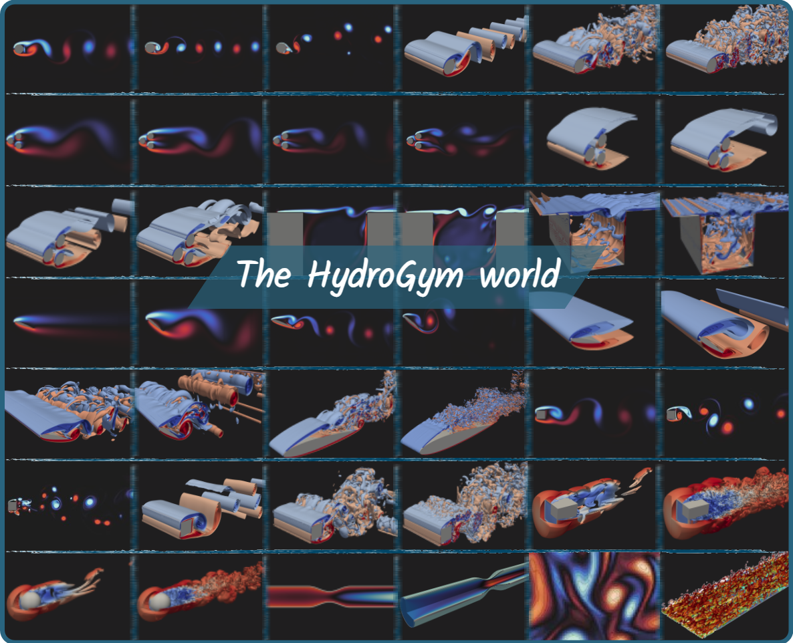

# m-AIA meets HydroGym

[](https://cl126162.github.io/TheHydroGymProject/)


A high-performance lattice Boltzmann method (LBM) solver backend for the HydroGym reinforcement learning platform, providing GPU-accelerated computational fluid dynamics environments for flow control research.

## Overview

This repository contains the m-AIA implementation of HydroGym environments, enabling large-scale 2D and 3D flow simulations for training reinforcement learning agents on active flow control tasks. The solver leverages lattice Boltzmann methods with adaptive mesh refinement and supports both CPU and GPU execution through MPI and hardware-agnostic parallelization.

## Key Features

- **42+ Flow Control Environments**: Circular/square cylinders, fluidic pinball, cavity flows, NACA airfoils, stenotic pipes, cubes, spheres.
- **Reynolds Number Range**: Re = 100 to 50,000 across different configurations.
- **GPU Acceleration**: Hardware-agnostic implementation supporting NVIDIA and AMD GPUs.
- **Scalable Parallelization**: MPI-based domain decomposition with proven HPC scaling.
- **Standard RL Interface**: OpenAI Gym-compatible API for seamless integration with RL frameworks.
- **Multiple Actuation Strategies**: Synthetic jets, surface rotation, temperature control.
- **Flexible Sensing**: User-configurable point probes for velocity, pressure, and body forces.

---

## Installation

__IMPORTANT NOTE: This package is an incomplete official public release to demonstrate HydroGym's ease-of-use and versatility. The full m-AIA based HydroGym backend including the related m-AIA HPC CFD solver will released upon publishment of the coresponding paper.__

### From Source

```bash
# Clone the repository
git clone https://github.com/cl126162/TheHydroGymProject
cd hydrogym-maia

# Install dependencies
pip install -e .
```

### With Docker

For containerized deployment:

```bash
# Build GPU version
docker build -t hydrogym-maia-gpu .

# or CPU version locally
docker build -t hydrogym-maia-cpu .
```

---

## Quick Start

### Basic Environment Usage

```python
env_config = {
    "configuration_file": config_file,
    "is_testing": False,
    "render": False,
    # set customized probes values
    "probe_locations": probe_locations,
    }

# available environments
envs = {
        'cylinder': maiaGym.Cylinder,
        'rotary_cylinder': maiaGym.RotaryCylinder,
        'pinball': maiaGym.Pinball,
        'jet_pinball': maiaGym.JetPinball,
        'naca0012': maiaGym.NACA0012,
        'cavity': maiaGym.Cavity,
        'cavity3Jet': maiaGym.Cavity3Jet,
        'square_cylinder': maiaGym.SquareCylinder,
        'cube': maiaGym.Cube,
        'sphere': maiaGym.Sphere,
        }

# initialize cylinder environment
env = envs[maiaGym.Cylinder](env_config=env_config)

# reset environment
env.reset()

for i in range(100):
    obs, reward, done, _, _ = env.step(action=np.random.uniform(-env.MAX_CONTROL, env.MAX_CONTROL, size=env.num_inputs))
    
    if done or i % args.resetInterval == 0:
        print('Reset environment',flush=True)
        env.reset()

# close environment
env.maiaInterface.finishRun()
```

### TorchRL Usage
TorchRL examples for PPO, DDPG and TD3 are given in 'torchRL_examples'.

---

## Available Environments

| Environment       | Reynolds Numbers       | Dimensions | Control Objective                    |
|-------------------|------------------------|------------|--------------------------------------|
| Cylinder          | 100, 200, 1000, 3900   | 2D, 3D     | Drag reduction, wake stabilization   |
| Fluidic Pinball   | 30, 75, 100, 150       | 2D, 3D     | Drag reduction                       |
| Cavity            | 4140, 7500             | 2D, 3D     | Shear layer stabilization            |
| Square Cylinder   | 200, 1000, 3900        | 2D, 3D     | Drag reduction, wake stabilization   |
| NACA 0012         | 100-50000              | 2D, 3D     | Gust mitigation, wake stabilization  |
| Cube              | 300, 3700              | 3D         | Drag reduction, wake stabilization   |
| Sphere            | 300, 3700              | 3D         | Drag reduction, wake stabilization   |
| Stenotic Pipe     | 100                    | 3D         | Temperature control                  |

*See the paper for detailed environment descriptions and validation results.*

---


## Citation

If you use HydroGym in your research, please cite:

```bibtex
@article{lagemann2025hydrogym,
  title={HydroGym: A Reinforcement Learning Platform for Fluid Dynamics},
  author={Lagemann, Christian and Mokbel, Sajeda and Gondrum, Miro and R{\"u}ttgers, Mario and Callaham, Jared and Paehler, Ludger and Ahnert, Sam and Lagemann, Kai and Adams, Nikolaus and Meinke, Matthias and Loiseau, Jean-Christophe and Lagemann, Esther and Brunton, Steven L},
  journal={arXiv preprint},
  year={2025}
}
```

---

## Acknowledgments

This work builds on the m-AIA solver continuously developed at RWTH Aachen University's Institute of Aerodynamics for over two decades. This implementation is part of the broader HydroGym platform initiative for democratizing reinforcement learning research in fluid dynamics.

---

## Related Projects

- [HydroGym](https://cl126162.github.io/TheHydroGymProject/)
- [HydroGym JAX Backend](https://github.com/dynamicslab/hydrogym/tree/sm-jax-env)
- [HydroGym Firedrake Backend](https://github.com/dynamicslab/hydrogym)
```
